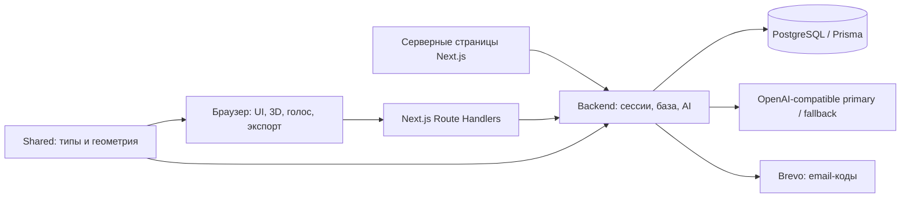
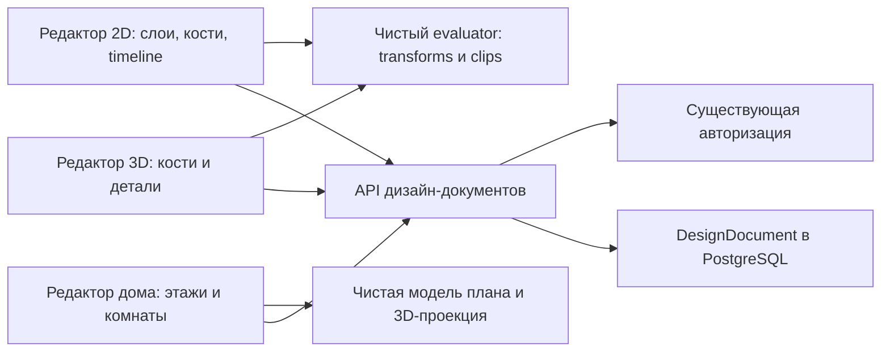

# Архитектура Atrion 2.0

База текущей архитектуры: удалённая `main`, коммит `26ea85d9f9a4c76cc314e30a105664af7a7cf1f0`, повторно проверенный 5 октября 2026 года. Ветка `codex/backend-rigging` добавляет вычисления, приватное хранилище документов и ручные редакторы ригов. Подробности состояния и отличий старой копии — в [PROJECT_STATUS.md](docs/PROJECT_STATUS.md).

## Приложение и границы

Это одно приложение Next.js App Router, а не отдельные frontend/backend сервисы. React, TypeScript и Tailwind используются для UI; React Three Fiber, drei и Three.js — для сцены и экспорта. PostgreSQL доступен через Prisma. Версии зависимостей и команды определяют [package.json](package.json) и lockfile.

| Путь | Ответственность |
| --- | --- |
| [src/app](src/app) | Страницы, layouts, загрузка, ошибки, metadata |
| [src/app/api](src/app/api) | HTTP-контракты и проверки доступа |
| [src/backend](src/backend) | Auth, AI, квоты, почта, генераторы |
| [src/frontend](src/frontend) | Компоненты, настройки, CSG, голос, экспорт |
| [src/shared](src/shared) | Контракты и общие вычисления |
| [prisma/schema.prisma](prisma/schema.prisma) | Схема PostgreSQL |
| [.github/workflows/ci.yml](.github/workflows/ci.yml) | Node 22, npm ci, типы и сборка |

## Основные потоки

Проект: авторизация → идея → запись `Project` со статусом `draft` → вопросы и `interview` → ответы → `Blueprint` и `generated`. Поля интервью и blueprint содержат JSON в строках. Повторная генерация перезаписывает результат. Экспертные консультации и стартовый код возвращаются клиенту; отдельных таблиц для них нет. История версий в `ProjectInsights` хранится в localStorage.

3D: prompt → настроенный текстовый AI → проверка примитивов, размеров и повторений → до одного исправления → `ThreeDConcept` и диагностика. Процедурный генератор используется при отказе AI и явно обозначается как fallback. Его число деталей и score не заменяют валидный ответ AI. Размеры baseline и его список секций больше не передаются как ориентир, отдельные детали не сближаются автоматически. Основные модули — [ai.ts](src/backend/ai.ts), [text-ai.ts](src/backend/text-ai.ts), [gen](src/backend/gen). Редактор и экспорт используют прежний общий контракт; сохранение обычной 3D-сцены в новый store не добавлено.

Сессия: bcrypt-хеш пароля → JWT HS256 → cookie `atrion_session` на 30 дней (`httpOnly`, `sameSite=lax`, `secure` в production). `requireApiUser` дополнительно проверяет email при включённом флаге. Просроченный Pro переводится в Free при чтении тарифа. Ротация `AUTH_SECRET` делает старые session/share токены недействительными.

Email: Brevo HTTP API отправляет шестизначный код; код и TTL сохраняются в `User`. Проверка email включается флагом. Сброс пароля требует настройки отправителя даже при выключенной проверке email. Коды хранятся открытым текстом, это текущее ограничение.

AI: JSON-запрос к primary, одна попытка fallback для распознанных ошибок compatible-провайдера/JSON; Cloudflare на резерв не переключается. Функции с локальным fallback возвращают демонстрационный результат при отсутствии ключей или ошибках. Проверка доступности `/api/3d/providers` сообщает о конфигурации, не проверяет реальный доступ провайдера. Дневная квота хранится в PostgreSQL и обновляется по UTC. Возврат квоты выполняется при исключении маршрута; успешный fallback не возвращает квоту.

## Данные и границы доверия

`User` содержит профиль, хеш пароля, email/reset-коды, тариф, срок Pro и счётчики. `Project` принадлежит одному User; удаление User каскадно удаляет проекты. Моделей платежей, команд и организаций в актуальной схеме нет.

Публичная ссылка — JWT с `purpose=project-share` и сроком 30 дней. Страница читает текущий blueprint, а не снимок. Доступ есть у любого обладателя ссылки; точечный отзыв ссылки не реализован. Приватные project API проверяют владельца.

Auth rate limiter хранит счётчики в памяти одного экземпляра и отключён в development. Он не является глобальным лимитером распределённого production. `AUTH_SECRET`, `DATABASE_URL`, AI- и Brevo-ключи остаются серверными. Текст 3D prompt сейчас попадает в диагностический лог; срок хранения и политика удаления логов не установлены.

## Эксплуатация и ограничения

Репозиторий содержит CI, конфигурацию Neon и указания на Vercel. Фактическое состояние production, базы, доставки почты и переменных хостинга этой задачей не проверялось. Миграционной истории нет: существующая команда — `prisma db push`; процесс безопасного изменения production-схемы требует отдельного решения.

Finik отсутствует в актуальном коде. На странице тарифов есть WhatsApp-ссылка для ручной оплаты; автоматической выдачи Pro и интерфейса администратора нет. Приоритетная генерация указана в тарифе, но очереди приоритетов не найдено. Будущие изменения — предложения в [ROADMAP.md](ROADMAP.md), а не компоненты действующей архитектуры.

## Дизайн-документы и редакторы

2D skin хранится как optional поле слоя в общем `Rig2DDocument`: UV, треугольники, веса. Parser валидирует ссылки, суммы весов и бюджеты геометрии; evaluator возвращает мировые вершины через linear blend skinning, без браузерных API. `src/shared/rigging/fullbody.ts` собирает скелет и сетку по указанным суставам; `cutout.ts` выполняет заливку белого фона. `PrepareCharacter` декодирует/сжимает рисунок, даёт исправить суставы и устанавливает готовый документ. `RigCanvas` отображает текстуру треугольников и выполняет FK-drag с одной транзакцией undo. Генерация рисунка остаётся отдельным авторизованным серверным запросом; сборка рига и каждый кадр выполняются локально. `RigEditor` отделяет временный preview клипа от сохранённого pose; play не изменяет документ, pause оставляет время кадра, начало ручного редактирования фиксирует показанную позу. Новый полный риг и dev fixture автоматически проигрывают приветствие. Мимики, inpainting и physics runtime пока нет.

Риггинг отложен по последнему указанию пользователя. Текущий этап развивает текстовый AI, генерацию 3D и редактор дома в существующем Next.js-приложении.

Общие сервисы: auth, доступ к собственным документам, сериализация и история изменений. Доменные контракты разделены: `Rig2DDocument`, `Rig3DDocument` в `src/shared/rigging`, `HouseDocument` в `src/shared/house`. Страницы `/dashboard/rigging` и `/dashboard/house` реализуют ручное редактирование. Дом не помещается в software `Blueprint`.

В браузере выполняются управление костями, FK, timeline и интерактивное воспроизведение; сеть не нужна для каждого кадра или движения мыши. Чистые контракты/FK/редакторские операции находятся в `src/shared/rigging`; прежние backend-модули реэкспортируют их. Canvas отображает 2D; ConceptViewer переиспользуется для rigid 3D с overlay костей. PNG/WebP могут быть встроены в JSON. LocalStorage хранит черновики по типу и контексту preview/editor, sessionStorage передаёт сцену Design Engine. Backend отвечает за авторизацию, проверку документов, сохранение и опциональные AI-задачи. Интерактивные страницы должны использовать существующие client/server границы.

Добавлена модель `DesignDocument`: ownership через `userId`, `kind`, `name`, JSON `data`, optimistic `revision`, timestamps и каскадное удаление с User. `store.ts` проверяет владельца в запросе и в атомарной записи; stale revision даёт 409. Создание сериализуется блокировкой User, чтобы лимит 100 не обходился параллельными запросами. Таблица требует отдельного применения схемы к выбранной базе. Слои изображений требуют хранить стабильные asset ID, MIME, размеры и ссылку/байты в экспортном пакете. Blob URL из браузера нельзя считать постоянным сохранением. Провайдер объектного хранилища не утверждён; существующая конфигурация Neon сама по себе такого хранилища не создаёт.

AI необязателен для ручного риггинга и параметрического дома. Автоматическое разрезание персонажа, расстановка костей, weight painting и генерация анимаций — отдельные будущие возможности с отдельной проверкой провайдера. MCP/skills из [TOOLING.md](docs/TOOLING.md) обслуживают разработку и не предоставляют конечному пользователю приложения эти функции.

Детальные контракты, ограничения и приёмка вынесены в [RIGGING_2D.md](docs/RIGGING_2D.md), [RIGGING_3D.md](docs/RIGGING_3D.md) и [HOUSE_DESIGN.md](docs/HOUSE_DESIGN.md). 2D использует Canvas без новых зависимостей. Серверное API хранит optional pose обоих ригов. Правила редактора — [RIGGING_EDITOR.md](docs/RIGGING_EDITOR.md). Первый этап реализован отдельно: `src/backend/characters/concept.ts` проверяет описание/изображение и управляет квотой; `providers.ts` выбирает Cloudflare Workers AI + FLUX (по умолчанию) либо OpenAI по серверной настройке, `/api/characters/concept` проверяет auth и резервирует/возвращает AI-квоту, `CharacterGenerator` отображает скачиваемый рисунок. Ключи/аккаунт из server env; публичный статус содержит только configured/provider/imageMime. Автоматического fallback нет. Cloudflare вызывается по фиксированному официальному адресу с тайм-аутом, запретом redirects и лимитом потокового ответа; текстовый ключ не переносится на другой endpoint. MIME и расширение JPEG/WebP согласованы через `src/shared/characters.ts`. Изображение не сохраняется в DesignDocument и не становится автоматически слоёвым ригом. Полная генерация персонажа по тексту требует асинхронного процесса и больших ассетов: [CHARACTER_GENERATION.md](docs/CHARACTER_GENERATION.md).

### Редактируемая геометрия 2D

`Skin2D.uv` отделяет выборку текстуры от исходных `vertices`. Поле необязательное в версии 1: старые документы используют vertices как UV до первого редактирования. Parser проверяет размеры, диапазон и невырожденность UV, evaluator передаёт независимые UV в renderer. `src/shared/rigging/mesh.ts` содержит чистые операции регулярной триангуляции, перемещения, вставки и удаления вершин. `MeshEditor` ведёт временную геометрию drag локально; завершение проходит через общую валидацию, историю и сохранение `RigEditor`. Сервер читает тот же контракт; браузерные API в shared отсутствуют. Приоритет дальнейшего развития определяется [новым ТЗ](docs/RIGGING_ENGINE_SPEC.md).

### Инструкции генерации 3D

`src/backend/gen/ai-geometry.ts` отделяет состав объекта от верхнего ориентира сложности. Нет минимального числа деталей: допустим одиночный примитив. Baseline не задаёт пропорции или секции AI. Повторное исправление получает реальные замечания и уточнения пользователя, включая PBR-свойства; оно не требует окон, крыш или добавления деталей. `scoreParts` остаётся старой эвристикой сложности для диагностики, не оценкой узнаваемости. Регрессионные проверки — `scripts/ai-geometry-prompts.test.ts`.

`text-ai.ts` выбирает прежний compatible-провайдер или Cloudflare при отсутствии прежних ключей; `AI_TEXT_PROVIDER` позволяет явно выбрать или отключить его. Cloudflare-токен отправляется только на фиксированный официальный account endpoint. JSON schema для Workers AI передаётся непосредственно, для compatible-провайдера — через named wrapper. Ответ всё равно проверяется доменным кодом. Обрыв ответа, отсутствие choices/контента и ошибочный JSON отклоняются.

Текстовая планировка: `house-generation.ts` извлекает программу помещений, получает список с долями площади, затем `house-layout.ts` вычисляет дерево сбалансированных делений и координаты без перекрытий/пропусков. Двери соединяют граф соседних комнат, окна размещаются на свободных наружных стенах; точные позиции требуют ручной проверки. `parseHouse` и проверка покрытия/входа/связности выполняются до установки документа. `/api/house/generate` использует designAuth и суточную AI-квоту с возвратом при ошибке; отдельный счётчик Free для обычного `/api/3d/generate` сохранён. Генерация дома не сохраняет документ в аккаунте автоматически.

### Единый документ дома

`src/shared/house/document.ts` содержит HouseDocument, parseHouse и buildHouse; backend/design/house оставлен совместимым реэкспортом. Серверная валидация и HouseEditor используют один контракт и одну чистую проекцию геометрии. `shared/house/editor.ts` задаёт начальную планировку, безопасное разделение комнаты и адаптер ThreeDConcept для просмотра/экспорта.

HouseEditor хранит историю доменных документов: undo/redo пересчитывает оба представления. Прямые CAD overrides производной сцены не предлагаются. Скрытие крыши/этажей влияет только на просмотр; GLB строится из полного документа. Локальный черновик изолирован между preview и авторизованным редактором; нечитаемый черновик не перезаписывается. Импорт ограничен 1 MiB и проходит общий parser. На время серверного открытия/сохранения редактирование блокируется, конфликт revision показывается без перезаписи.

### Деформеры

`shared/rigging/deformers.ts` содержит чистые типы, валидацию, билинейный Warp и преобразование вокруг pivot. `parseRig2D` сохраняет цепи и назначения, `evaluateRig2D` применяет их между placement слоя и взвешенными bone deltas. Старый путь без деформеров сохраняется. `DeformerPanel` управляет формой через общую историю RigEditor; временный drag preview не записывается в документ до завершения. Сервер и Canvas используют один evaluator.

## Параметры деформеров 2D

`shared/rigging/parameters.ts` валидирует диапазоны, ключевые формы и временные треки, интерполирует формы без изменения исходного документа. Evaluator сначала вычисляет значения параметров (сохранённое → clip → явный override), подставляет формы в деформеры, затем применяет цепи и bone skinning. Warp проверяется на вырождение во всём интервале между соседними формами, а не только в ключах.

`ParameterPanel` создаёт параметры/формы и треки через общую историю `RigEditor`. При правке формы только её параметр временно исключается из вычисления; остальные параметры продолжают действовать. Перетаскивание ползунка использует временный preview и один undo-шаг. Серверный evaluate принимает `options.parameterValues`; JSON/приватное хранилище используют общий parser без отдельной схемы БД.

## Растеризация mesh 2D

`mesh-texture-renderer.ts` рисует слой одним indexed WebGL draw в прозрачный offscreen canvas и синхронно переносит его на основной Canvas. Матрица текущего Canvas задаёт переход в пиксели; UV учитывают +y вверх. Premultiplied alpha сохраняет прозрачность без повторного смешивания на общих рёбрах. Ресурсы принадлежат холсту, кэш ограничен 32 текстурами и освобождается при unmount; потеря контекста переключает на Canvas, восстановление пересоздаёт GPU-ресурсы.

Canvas продолжает рисовать сетку, кости, UI и совместимый текстурный fallback (включая внешние изображения без CORS). Это не завершённый GPU-runtime и не подтверждение 60 FPS на предельном бюджете. Настройки загрузки/alpha сверены с [WebGL pixelStorei](https://developer.mozilla.org/en-US/docs/Web/API/WebGLRenderingContext/pixelStorei).
