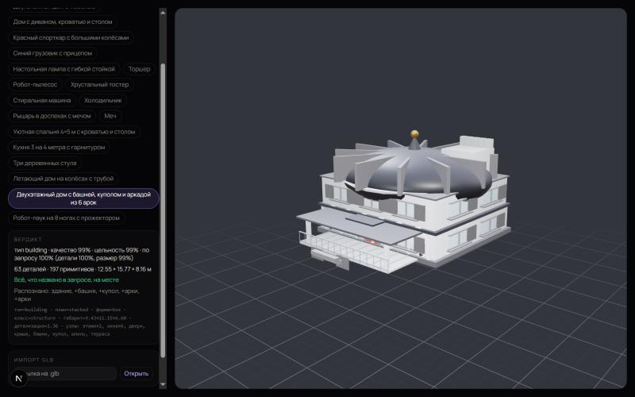
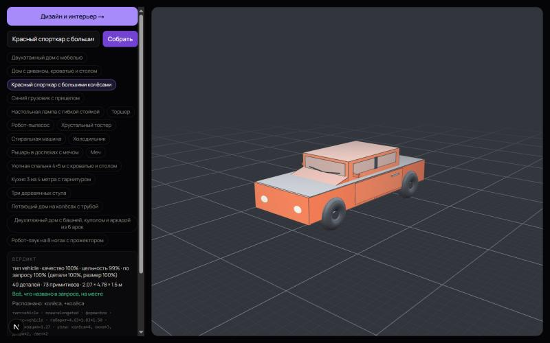
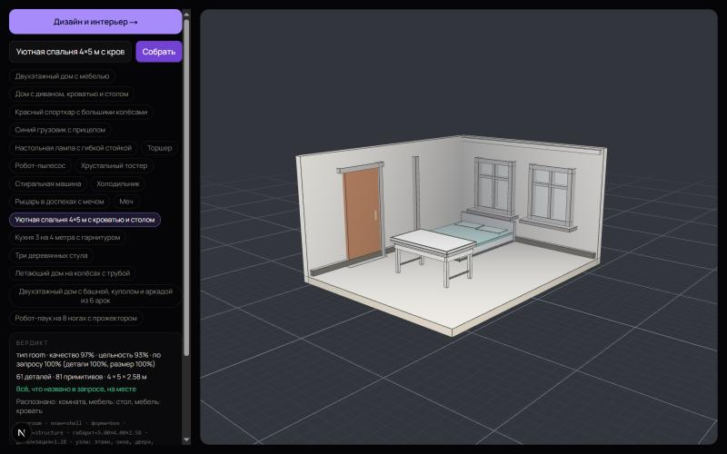

# Atrion 2.0

**Опишите объект словами — получите редактируемую 3D-модель за минуты.**

[](https://github.com/alitojcubekov206-svg/atrion-2.0/actions/workflows/ci.yml)

🔗 **Демо:** https://atrion-2-0.vercel.app<br>
🎟️ **Вход без регистрации (для жюри):** https://atrion-2-0.vercel.app/api/auth/demo — создаёт гостевой аккаунт и сразу открывает 3D-студию.

*English version below ↓*

| Дом с башней и куполом | Спорткар | Спальня 4×5 м |
|---|---|---|
|  |  |  |

## Что это

Atrion — браузерная студия, которая превращает обычный текст («двухэтажный дом с башней и аркадой из 6 арок», «мост на 8 полос», «уютная спальня 4×5 м») в 3D-модель из отдельных деталей. Каждую деталь можно двигать, вращать, масштабировать и править через чат или голосом, а результат — скачать для Unity, Blender или 3D-печати.

## Возможности

- **Текст → 3D.** Здания (дом, торговый центр, школа, больница, склад, храм и др.) с собственной формой для каждого типа, мосты с учётом числа полос, машины, мебель, комнаты, персонажи и животные.
- **CAD-редактор.** Move / Rotate / Scale для каждой детали, разнесённый вид, режим «Разрез», undo/redo.
- **Правки словами.** «Сделай окна шире», «увеличь крышу на 20%» — через чат или голосовые команды.
- **Дизайн интерьера.** Комнаты, мебель из библиотеки FORMA, отделка; список закупки с выгрузкой в CSV.
- **Экспорт.** GLB (цвета и материалы, tangents для Unity), STL, OBJ.
- **Реалистично.** Одна кнопка — нейросеть TRELLIS строит настоящую 3D-модель с текстурой (~1–2 мин).
- **Устойчивый AI.** Основной провайдер, резервный провайдер и локальный процедурный генератор — модель появляется, даже если внешний AI недоступен.

## Как это работает

```
текст → разбор запроса → blueprint (тип, размеры, части) → геометрия
      → проверка (габариты, связность без «летающих» деталей, всё ли названное есть)
      → исправление → 3D-сцена
```

Сервер сам оценивает результат: для каждой модели считаются качество, цельность и соответствие запросу, а пропущенные элементы («колёса», «крыша») возвращаются на доработку. Это видно в панели «Вердикт» на скриншотах.

## Стек

Next.js 15 (App Router) · React 19 · TypeScript · Tailwind CSS · React Three Fiber + drei · three-bvh-csg · Prisma + PostgreSQL (Neon) · JWT (jose) · OpenAI-совместимые AI-провайдеры · Vercel.

## Запуск локально

```bash
npm ci
npm run dev
```

Без базы и ключей можно открыть песочницу генератора: http://localhost:3000/playground/generator (только в development). Для полного приложения скопируйте `.env.example` в `.env` и заполните значения — подробности в [docs/DEVELOPMENT.md](docs/DEVELOPMENT.md) и [docs/CONFIGURATION.md](docs/CONFIGURATION.md).

Проверки (выполняются и в CI на каждый push):

```bash
npm run test:backend
npx tsc --noEmit
npm run build
```

## Честно об ограничениях

- Модели — AI-концепты, а не инженерный расчёт: несущие конструкции, нормы и сметы не проверяются.
- Экспорт GLB проверен загрузчиком геометрии; импорт внутри Unity Editor не тестировался.
- Риггинг и анимация персонажей в экспорт не входят.

## Документация

[SPEC.md](SPEC.md) — поведение · [ARCHITECTURE.md](ARCHITECTURE.md) — устройство · [docs/GENERATION_QUALITY.md](docs/GENERATION_QUALITY.md) — требования к качеству · [docs/INTERIOR_DESIGN.md](docs/INTERIOR_DESIGN.md) — интерьеры · [docs/UNITY_EXPORT.md](docs/UNITY_EXPORT.md) — экспорт в Unity · [docs/TEAM_WORKFLOW.md](docs/TEAM_WORKFLOW.md) — кто где работает

---

## English

**Describe an object in words — get an editable 3D model in minutes.**

🔗 **Live demo:** https://atrion-2-0.vercel.app<br>
🎟️ **No-signup login for judges:** https://atrion-2-0.vercel.app/api/auth/demo — creates a guest account and opens the 3D studio.

Atrion is a browser studio that turns plain text ("a two-storey house with a tower and a 6-arch arcade", "an 8-lane bridge", "a cozy 4×5 m bedroom") into a 3D model built from separate parts. Every part can be moved, rotated, scaled and edited by chat or voice, and the result exports to Unity, Blender or a 3D printer.

**Features**

- **Text → 3D:** buildings with a distinct shape per type (house, mall, school, hospital, warehouse, temple…), bridges that respect the requested lane count, vehicles, furniture, rooms, characters and animals.
- **CAD editor:** per-part Move / Rotate / Scale, exploded view, section view, undo/redo.
- **Edit with words:** "make the windows wider", "scale the roof up 20%" — by chat or voice.
- **Interior design:** rooms, furniture from the FORMA library, finishes, and a procurement list with CSV export.
- **Export:** GLB (colors, materials, Unity-ready tangents), STL, OBJ.
- **Realistic mode:** one click builds a real textured 3D mesh with TRELLIS (~1–2 min).
- **Resilient AI:** primary provider, fallback provider and a local procedural generator, so a model appears even when external AI is down.

**How it works:** text → request parsing → blueprint (type, dimensions, parts) → geometry → validation (bounds, connected parts with nothing floating, every named element present) → repair → 3D scene. The server scores each model for quality, integrity and match to the request, shown in the "Verdict" panel.

**Stack:** Next.js 15, React 19, TypeScript, Tailwind CSS, React Three Fiber, three-bvh-csg, Prisma + PostgreSQL (Neon), JWT (jose), OpenAI-compatible AI providers, Vercel.

**Run locally:** `npm ci && npm run dev`, then open http://localhost:3000/playground/generator — no database or API keys needed (development only). Full setup: [docs/DEVELOPMENT.md](docs/DEVELOPMENT.md), [docs/CONFIGURATION.md](docs/CONFIGURATION.md). Checks: `npm run test:backend`, `npx tsc --noEmit`, `npm run build` (also run in CI).

**Limitations:** models are AI concepts, not engineering calculations; GLB export is validated by a geometry loader but not tested inside the Unity Editor; rigging is not included.

## Лицензия / License

All rights reserved — см. [LICENSE](LICENSE).
