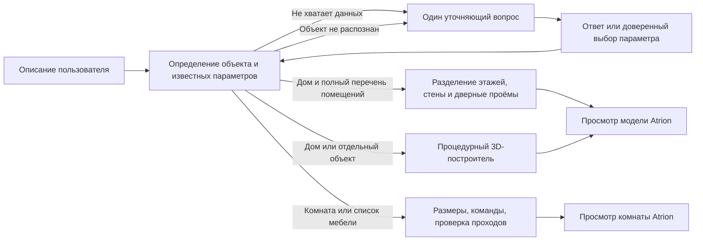

# Одно поле для комнаты и 3D-объекта

**Дополнение 2026-10-08:** описанные ниже правила сохранены как режим «Быстро · по правилам». Новый режим «Локальная нейросеть · CPU» обходит классификатор и составляет сцену по всему тексту, с динамическими уточнениями и предыдущей композицией для правок. Установка, API и ограничения — [LOCAL_AI.md](LOCAL_AI.md). В dev API он включается явно через `engine: "local-ai"`; заявления ниже об отсутствии AI относятся к старому режиму.

## Проблема и решение

На скриншоте пользователя в `/playground/interior` введено «дом», но экран остаётся интерьером. Поле вызывало только ограниченный планировщик мебели. Общий процедурный 3D-построитель уже существовал отдельно и не был подключён.

`DesignWorkspace` сначала определяет предмет и недостающие параметры, затем строит модель. По последнему уточнению пользователя короткое «дом» начинает диалог: помещения → этажность → габариты. Уже заданные параметры пропускаются. Один свободный ответ может закрыть несколько вопросов; позднее явное значение заменяет прежнее. Можно выбрать вариант или написать «подбери сам» для текущего параметра, а в исходном описании — «остальное реши сам». Выбранные автоматически параметры показаны в результате.

Для комнаты уточняется назначение/мебель, для животного — отсутствующая поза, для общей «машины» — тип кузова. Полное описание генерируется сразу. Неизвестный предмет вызывает вопрос о том, что именно нужно построить. Разбор основан на локальных правилах; это контекстный диалог без внешних API, не самостоятельное нейросетевое мышление.

Комната остаётся в памяти; кнопка «Вернуться к комнате» возвращает её. У модели доступны вращение, разрез, GLB и JSON, без прогулки. «Спальня», «гостиная», «кабинет», описание комнаты и список нескольких предметов мебели используют интерьерный путь. Остальные распознаваемые объекты используют общий построитель.

## Сервер и данные

- `POST /api/playground/design` доступен только при `NODE_ENV=development`, иначе 404 до чтения запроса. Принимает `{prompt, answers?, scene?, editing?}`; возвращает различимые `kind: clarification | interior | model`. БД, AI-провайдеры и внешние сервисы не вызываются. Команды редактирования готовой комнаты обходят первичный диалог.
- `POST /api/design/brief` требует сессию и возвращает `clarification | ready`, без расхода квоты. Ответы имеют `{questionId, answer}`; до 12 ответов по 500 символов. При изменении исходного запроса UI сбрасывает прежний диалог.
- `POST /api/design/model` принимает `{prompt, answers?}`; исходный текст 1–1500 символов. Всегда требует сессию. Учёт генерации без тарифных лимитов резервируется только после получения полного задания; ошибка построения возвращает её. Повторно вычисляет задание на сервере, не доверяя присланному клиентом готовому плану. Это CPU-построитель без автоматического платного fallback даже при наличии ключей в окружении.
- Сохранение и очереди интерьера продолжают использовать прежние приватные API. Предварительная подготовка размеров общая для preview и worker. Проёмы не перемещаются молча: не помещающийся проём вызывает ошибку. Положение источников света пересчитывается относительно новых размеров.
- `generateLocalModel` вызывает построитель напрямую. Неизвестный тип `product` возвращает 422 `DESIGN_SUBJECT_UNKNOWN`; случайная фигура и аварийный fallback не выдаются за выполнение задания. Распознанные признаки и обнаруженные пропуски показаны рядом с результатом.
- Отдельная модель не сохраняется в интерьерный проект или БД. GLB/JSON нужно скачать перед закрытием страницы. Переключение назад сохраняет текущую комнату в памяти.

## Дом по ответам

`brief-model.ts` передаёт перечень помещений в существующий `compileHouseLayout`, затем проверяет `checkGeneratedHouse` и строит геометрию через `buildHouse`. Число комнат меняет перегородки и дверные проёмы, число этажей — перекрытия. Отдельные комнаты не склеиваются в название фасада. Можно указать только общее число: тогда назначение останется «Комната 1» и т. д. Каждое названное помещение появляется ровно один раз. Размеры означают габарит этажа; крыша выступает за него.

Доступны 1–3 этажа, до 24 помещений суммарно, прямоугольный и Г-образный контуры, пять форм крыши и разные фасады по описанию. Площади и распределение по этажам выбираются автоматически. Дом получает внутреннюю обстановку, отделку пола, оконные рамы/стекло, двери/ручки и крыльцо. Наружный вход есть только на первом этаже. Лестницы, открывание дверей и инженерные сети пока не строятся; ограничения показаны в результате. Точные параметры и вариации: [HOUSE_ARCHITECTURE.md](HOUSE_ARCHITECTURE.md).

`shared/house/furnishing.ts` создаёт интерьерную сцену для каждого помещения. Спальни получают кровать, шкаф, тумбы, светильник и растение; кухня-гостиная — гарнитур с мойкой/плитой, холодильник, диван, стол и стулья; санузел — душ, унитаз и раковину. Для прихожей, кабинета, детской, столовой и хранения есть свои наборы. Комнатам без назначения предлагается гостиная или спальня с явной пометкой. «Без мебели» сохраняет пустой интерьер. Стиль и распознанные пожелания к мебели учитываются локальными правилами, без универсального понимания речи.

Размеры мебели берутся из каталога, при расстановке резервируются внутренние границы стен и дверные проходы с обеих сторон общей стены. Проверяются пересечения и доступ шириной 0,6 м. Предметы, которые не удалось разместить, перечисляются в предупреждениях. Комнаты с полезными размерами вне 2–30 м не обставляются автоматически.

Новая модель показывает дом целиком со стороны входа. При выборе этажа верхние перекрытия/крыша скрыты, стены и двери укорочены. Есть вид сверху, приближение комнаты и список её мебели. `HouseViewer` и GLB используют одинаковые подробные модели мебели, включая процедурные текстуры. «Дом целиком» возвращает наружный вид. JSON содержит `houseDocument` и `interiors`; GLB всегда содержит весь дом и обстановку на всех этажах, независимо от выбранного вида.

## Команды интерьера

Добавлены стандартная обстановка по короткому названию комнаты, пустая комната, разные цвета мебели/стен/пола, обеденный стол, количество с прилагательным («два белых стула»), исключения в списках, поворот на заданное число градусов, правка конкретного assetId. Кресло больше не выбирается вместо стула; шкаф — вместо стеллажа. Цвет новой мебели применяется после стилевой палитры. Закрепление, коллизии и проверка проходов сохраняются.

Размеры читаются из текста и в локальном предпросмотре: «Спальня 4×5 метров с кроватью и шкафом» создаёт два предмета в комнате 4×5 м. Числа габаритов не принимаются за количество мебели. Нераспознанная отдельная часть команды прерывает изменение без частичного результата.

## Ограничения

Это расширение доступных сценариев, а не универсальная нейросеть text-to-mesh. Разбор основного объекта, деталей и команд основан на словаре/эвристиках; сложные отношения, произвольные новые предметы и все детали естественного языка не гарантируются. Список распознанного и эвристическая проверка пропусков не доказывают полное соответствие запросу. Процедурные модели не являются фотореалистичными. Используется геометрический компилятор дома; нейросетевой вызов из `/api/house/generate` автоматически не включается. Изображение-посредник не создаётся.

## Проверка

Обстановка дома проверена 2026-10-08: `npm run test:backend` — 98 тестов и 193 проверки генератора; `npx tsc --noEmit` и `npm run build` — успешно. `interior-house.test.ts` проверяет назначение мебели, оба направления дверных проёмов, этажность, границы подробных мешей, отсутствие мебели по запросу, стиль, локальные пожелания и полный GLB. В браузере проверены этажи и приближение спальни. Скачанный через кнопку GLB содержит 26 объектов и пять помещений на двух этажах; заголовок, длина, узлы и встроенные текстуры проверены. Импорт в сторонние редакторы и реальная БД не проверялись.

`scripts/interior-requests.test.ts`: маршрутизация, короткие названия, неизвестный объект, dev-only endpoint, размеры, цвета, количество, отрицания, стандартная/пустая комната, точная правка мебели. `scripts/backend-safety.test.ts`: сессия, бесплатный доступ, возврат при ошибке и отсутствие сетевых вызовов нового production endpoint на фикстурах. Реальная БД и внешний импорт GLB требуют отдельной проверки.

`scripts/interior-brief.test.ts`: последовательный диалог, полный запрос без вопросов, несколько параметров в ответе, исправление значений, добровольный выбор значений по умолчанию и соответствие геометрии перечню помещений. Проверка квоты отдельно подтверждает, что уточняющий вопрос ничего не расходует.

Проверка 2026-10-08: `npm run test:backend` — 91 тест и 193 проверки генератора прошли; `npx tsc --noEmit` и `npm run build` завершились успешно. В браузере пройден диалог «дом» → пять помещений → два этажа → 12×9 м, получены соответствующий документ и планы этажей. Реальная база и внешние провайдеры не использовались.
