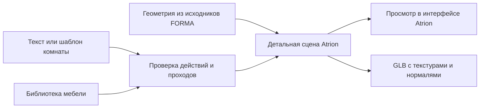

# Мебель FORMA внутри Atrion

## Текущее решение

По уточнению пользователя отдельный дизайн FORMA полностью удалён. Нет iframe, каталога FORMA, её меню, CSS, иллюстраций, прогулки или автотура. Основной редактор — `/dashboard/design`: тёмные поверхности и фиолетовые акценты Atrion, библиотека мебели и обычный осмотр 3D-модели мышью.

Из исходников FORMA используется только геометрия мебели в `src/shared/forma/furniture.js`. Она построена на установленном Three.js. Встроенных предметов в каталоге Atrion — 17: прежние 10 и кресло, пуф, банкетка, журнальный стол, комод, стеллаж, консоль. Размеры нормализованы к каталогу, включая ручки и скругления. Исходная папка пользователя в Downloads не менялась. В предоставленной компактной копии MD не было; до переноса проверены README.txt, HTML, bundle, схема и API. Изображение FORMA interior.png было концептуальной иллюстрацией, в текущем приложении оно не используется.

## Интерфейс и материалы

- Комната, поиск мебели, свойства предмета, история и экспорт находятся в интерфейсе Atrion. Отдельного бренда или страницы студии FORMA в навигации нет.
- Два стартовых шаблона — спальня и гостиная. Это редактируемые сцены, а не готовые изображения. Проверяются габариты, коллизии, доступность мебели и входа.
- Просмотр: вращение, приближение, общий вид и разрез. В разрезе скрываются ближайшие к камере стены; дальние остаются непрозрачными. Прогулка, полёт и персонаж отсутствуют.
- Пол получил раздельные доски и древесную текстуру, мягкая мебель — ткань, добавлены карты нормалей, оконные рамы, плинтусы, свет окружения и контактные тени.
- GLB использует ту же детальную геометрию; цветовые текстуры и карты нормалей встроены в файл. Разрез камеры, свет окружения и экранные тени не запекаются: экспорт содержит полную комнату.
- Геометрия и текстуры строятся локально без платных API. Браузеру требуется WebGL. Это процедурная визуализация с улучшенными материалами, а не подтверждённый фотореализм или нейросетевая генерация произвольного меша.

## Локальная проверка и сервер

`npm run dev` → `/playground/interior`. Можно менять материалы, добавлять и редактировать мебель, применять шаблоны и локальные текстовые команды. Размеры читаются из текста либо задаются в полях; доступен один вариант. Запросы дома и отдельных объектов теперь вызывают общий CPU-построитель в том же интерфейсе — [DESIGN_REQUESTS.md](DESIGN_REQUESTS.md). Изменения остаются в памяти страницы. Для комнаты доступны JSON/PNG; её GLB через сервер, история, аккаунты и облачное сохранение требуют БД. Отдельная модель экспортируется в GLB/JSON прямо в браузере. Production-песочница возвращает 404.

Старый `/dashboard/forma` перенаправляет на `/dashboard/design`. Старые `/forma/*` ведут на песочницу в development и на основной редактор в production. Публичные ресурсы прежней студии удалены.

Совместимые приватные API `/api/forma` и подготовленные таблицы оставлены для ранее созданных документов: данные не удаляются и не преобразуются в комнату Atrion. Новый редактор ими не пользуется. Общий лимит проектов пока учитывает эти записи, поэтому при подключении текущей серверной схемы нужны `prisma/add-interior.sql` и `prisma/add-forma.sql` в согласованной базе. SQL не выполнялся. R2 и Cloudflare подключаются по INTERIOR_DESIGN.md; реальные облачные операции в этой работе не проверяются.

## Проверки

Автотесты проверяют все 17 габаритов мебели, конечность треугольников, геометрию и текстуры/нормали GLB, проходы обоих шаблонов и распознавание конкретной мебели без подстановки лишнего стола. Проверки реальной PostgreSQL/R2 и импорта в сторонние 3D-редакторы не проводились. Backend-команды вынесены в чистый shared-модуль, чтобы локальный редактор использовал те же проверки без доступа к секретам или БД.
Результат проверки 2026-10-08: 75 тестов и 193 проверки генератора прошли, TypeScript и финальная последовательная production-сборка завершились успешно. В браузере подтверждены перенаправление старой ссылки, оформление Atrion, поиск и добавление пуфа в сцену; сообщений error/warn не обнаружено.
