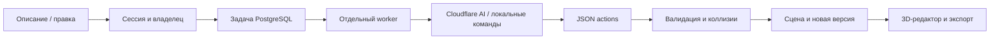

# Дизайн интерьера: реализованный этап

Обновление дома: планировка соединена с интерьерным каталогом. Теперь в нём 22 предмета: к 17 прежним добавлены кухонный гарнитур, холодильник, душевая кабина, унитаз и тумба с раковиной. Дом показывается с обстановкой по этажам, комнаты можно приблизить; GLB содержит весь дом с подробной мебелью. Проверяются границы и проходы; лестницы, дверные полотна и сети остаются за рамками. См. [DESIGN_REQUESTS.md](DESIGN_REQUESTS.md).

Единое поле комнаты и отдельного 3D-объекта, контекстные уточнения и точные ограничения описаны в [DESIGN_REQUESTS.md](DESIGN_REQUESTS.md). Короткий запрос «дом» начинает уточнение помещений, этажей и размеров, «спальня» — мебели. Полные задания сразу переходят к построению. Это процедурный путь без внешних API, не универсальная нейросеть.

Обновление: 17 предметов в библиотеке Atrion используют детальную геометрию и процедурные материалы, включая адаптированные шаблоны FORMA. Её отдельный интерфейс полностью удалён. Старая `assetParts` остаётся для совместимости упрощённого концепта; основной просмотрщик/API/GLB используют `detailedScene`/`detailedAsset`, включая карты нормалей. Текущая интеграция и ограничения — [FORMA_INTEGRATION.md](FORMA_INTEGRATION.md).

## Проблема и исходные требования

Пользователь хочет сохраняемую комнату с отдельными предметами, а не одноразовую картинку. Присланное ТЗ включает план, мебель, AI-команды, коллизии, версии и экспорт. Ранее Atrion имел генератор примитивов и генератор дома, но не сохраняемый интерьерный редактор. Пользователь явно разрешил backend и интерфейс и попросил подготовить бесплатные облачные подключения без локальной видеокарты.

Целевой пользователь — человек, который планирует обстановку комнаты. Задача: «Когда я выбираю мебель, хочу проверить её расстановку в комнате заданного размера и поменять отдельные предметы, сохранив остальные».

## Что добавлено

Вход: «Создать проект → Дизайн интерьера» или `/dashboard/design`. Редактор содержит параметры комнаты, девять стилевых палитр, проёмы, библиотеку, 3D-сцену, список предметов, команды и историю. Начальные дверь и окно — явно обозначенный пример, который нужно сверить с реальным помещением.

- Прямоугольная комната 2–30 м по каждой стороне, высота 2–6 м. Проёмы действительно вырезаны из стен. Размеры из текста новой генерации имеют приоритет над текущими габаритами; неприменимые проёмы вызывают ошибку, а не молча перемещаются.
- Десять оригинальных параметрических предметов: две кровати, диван, два стола, стул, шкаф, торшер, растение, тумба. Геометрия доступна как GLB. Это стилизованная стартовая библиотека, не фотореалистичный каталог поставщиков.
- SceneObject имеет устойчивый ID, assetId, позицию, поворот, масштаб, цвет и locked. Все изменения применяются к копии, затем проверяются целиком. Некорректная команда не оставляет частичную правку.
- LayoutEngine проверяет габариты с поворотом и масштабом, пересечения, свободную зону перед дверью и достижимость предметов по сетке для прохода шириной 0.6 м. Перебор нескольких ранних размещений помогает избежать неудачного жадного выбора. Это эвристика концепта, не проверка строительных норм и не симуляция открывания мебели.
- Один–три варианта, текстовая замена/добавление/удаление, перемещение к окну, закрепление, точные координаты, масштаб, цвет и поворот через интерфейс. Локальные явные команды поддерживают девять стилей, тёплый свет и увеличение яркости; API также поддерживает добавление/удаление источников света.
- Для AI дополнительно проверяется количество явно названной мебели из встроенного словаря. Если предметы пропущены, AI получает одну попытку исправления; повторное несовпадение завершает задачу с возвратом квоты. Это не проверка всех смысловых требований произвольного текста.
- Сохранение изменений параметров после 700 мс паузы. Изменения предметов сохраняются сразу. `revision` предотвращает перезапись новой сцены устаревшим запросом; конфликт возвращает 409. При отклонении autosave интерфейс возвращает последнюю принятую сервером сцену и показывает ошибку.
- Undo/redo, неизменяемые снимки before/after, восстановление версии. Новая ветка сбрасывает возможность redo, но не удаляет прежние снимки. В истории хранятся тип и источник изменения; отдельного журнала каждого UI-жеста пока нет.
- GLB и JSON выдаются сервером из сохранённой сцены; PNG снимается с настоящего WebGL-просмотрщика. PNG не подменяет модель. Экспорт небольшой сцены синхронный; отдельная очередь рендеров/экспортов пока не реализована.

## Архитектура и хранение



Чистые контракты, каталог и геометрия: `src/shared/interior/`. Серверные инструменты, репозиторий, worker и облачные адаптеры: `src/backend/interior/`. UI: `src/frontend/components/interior/`.

Три новые таблицы: `design_projects`, `design_versions`, `design_jobs`. Сцена, проёмы, предметы и свет хранятся структурированным JSONB со схемой версии 1. Это сознательное отличие от предложения ТЗ разнести каждую сущность по отдельной таблице: для атомарного MVP одной комнаты сцена сохраняется целиком. Каталог пока версионируется вместе с кодом. Сложные квартиры и каталог из тысяч моделей потребуют следующего этапа хранения и поиска.

AI не получает доступ к БД. Сервер принимает только разрешённые JSON-действия. `userId` берётся из сессии; чужой проект, история, файл и job возвращают 404. Файловые ключи создаёт сервер, пользовательское имя файла не используется. Ошибки имеют `{error:{code,message,requestId}}`; технические логи не содержат промпт, ключи или stack trace для клиента.

Очередь работает через `npm run design:worker`; HTTP возвращает 202, UI опрашивает `/api/jobs/:id`. Захват задачи — атомарный compare-and-set. Резерв квоты записывается в той же транзакции, что и job. Счётчики служат учёту, без тарифных лимитов. Возврат привязан к дню резервирования и выполняется один раз. При восстановлении worker задачи старше десяти минут помечаются неуспешными с возвратом квоты; без запущенного worker задачи не обрабатываются.

## API

Префикс `/api/design/projects`:

| Метод и путь | Действие |
|---|---|
| GET, POST `/` | Список / создание `{name,scene}` |
| GET, PATCH, DELETE `/:id` | Чтение / название с revision / удаление |
| GET, PATCH `/:id/scene` | Сцена / `{revision,scene}` или `{revision,actions}` |
| POST `/:id/generate`, `/:id/regenerate` | `{revision,prompt,variants:1..3}` → job |
| POST `/:id/assistant` | `{revision,prompt}` → job |
| GET `/:id/history` | Последние 50 снимков |
| POST `/:id/undo`, `/:id/redo` | `{revision}` |
| POST `/:id/restore` | `{revision,versionId}` |
| POST `/:id/variant` | `{revision,jobId,index}` |
| POST `/:id/export` | `{format:"glb"|"json"}` |
| POST `/:id/plan` | Бинарный файл, Content-Type и If-Match: revision |
| GET `/:id/plan` | Подписанная ссылка на оригинал, пять минут |
| POST `/:id/analyze-plan` | `{revision}` → job анализа |

`GET /api/design/assets?category=...&style=...&maxWidth=...&q=...` — поиск, до 20 элементов. `GET /api/design/assets/:id/model` — GLB. `GET /api/jobs/:id` — состояние и результат своей задачи.

## Запуск и изменение БД

Схема **не применялась к базе пользователя**. В репозитории нет baseline Prisma migrations; новый SQL находится в `prisma/add-interior.sql`. Он только добавляет таблицы и FK, не удаляет пользователей и старые проекты. Не запускать его повторно или против неизвестной базы. Сначала проверить целевую тестовую БД и резервную копию; production требует отдельного разрешения.

Для новой локальной пустой PostgreSQL можно использовать обычный процесс создания схемы Prisma. Для существующей БД после проверки целевого адреса применить additive SQL через администраторский инструмент или `prisma db execute --file prisma/add-interior.sql --schema prisma/schema.prisma`. Эта инструкция не является подтверждением применения. Затем:

```powershell
npm ci
npx prisma generate
npm run dev
# В отдельном терминале с теми же env:
npm run design:worker
```

Worker использует `.env`, затем `.env.local` и должен иметь тот же DATABASE_URL, что и приложение. Для serverless Next.js нужен отдельно работающий процесс worker; один деплой HTTP-маршрутов очередь не запускает. Для сохранения и истории нужна схема DesignProject; основной генератор /api/design/preview не зависит от неё.

Команда worker использует `tsx` из devDependencies: среде этого процесса нужны зависимости после полного `npm ci` или отдельно подготовленная сборка worker. Одного Next.js standalone-артефакта недостаточно.

## Бесплатные облачные подключения без локального GPU

По умолчанию `DESIGN_TEXT_PROVIDER=local`: ограниченные явные команды обрабатываются на CPU, внешний API не вызывается. `cloudflare` включает существующий Workers AI текстовый адаптер. OpenAI-compatible платный fallback новый интерьерный worker автоматически не выбирает. Локальный режим не понимает произвольную речь и не гарантирует распознавание всех пожеланий: для сложного задания нужен AI и проверка результата.

R2: заполнить `CLOUDFLARE_ACCOUNT_ID`, `DESIGN_R2_BUCKET`, `DESIGN_R2_ACCESS_KEY_ID`, `DESIGN_R2_SECRET_ACCESS_KEY` в секретах среды, не в Git и не в чате. Bucket должен оставаться приватным; S3-токен ограничить этим bucket. Оригинал и JPEG-копия хранятся отдельно. Загрузка проверяет потоковый размер, сигнатуру и декодирование; SVG с активным содержимым или внешними ссылками запрещён. PNG/JPEG/SVG — до 15 MiB, PDF — до 25 MiB, распакованное изображение — до 24 миллионов пикселей. Старые файлы при замене удаляются по возможности; для осиротевших объектов нужна политика хранения/очистки в bucket.

`DESIGN_VISION_ENABLED=true` включает `@cf/meta/llama-3.2-11b-vision-instruct` после настройки `CLOUDFLARE_API_TOKEN` и принятия лицензии Meta владельцем аккаунта. Приложение само лицензию не принимает. API получает только оптимизированную копию загруженного пользователем плана. Анализ извлекает **только читаемые размеры прямоугольных комнат**. Значение с confidence ниже 0.8 становится null. Даже высокую уверенность пользователь проверяет перед переносом размеров. Confidence — самооценка модели, не измеренная точность.

PDF сохраняется, но не растрируется и не анализируется: страницу нужно экспортировать в PNG/JPEG. Автоматическое распознавание стен, углов, дверей, окон и многоугольного контура пока не реализовано; интерфейс честно предлагает ручное заполнение.

По официальным страницам, проверенным 2026-10-08: Workers Free включает 10 000 Neurons/сутки, далее запросы блокируются без перехода на платный план; R2 Standard имеет бесплатный объём, но превышения тарифицируются. Это бесплатные квоты, а не обещание неограниченного бесплатного сервиса. Облачные аккаунты, bucket, ключи и тарифы в этой работе не создавались и не менялись.

Источники: [Workers AI pricing](https://developers.cloudflare.com/workers-ai/platform/pricing/), [R2 pricing](https://developers.cloudflare.com/r2/pricing/), [R2 signed URLs](https://developers.cloudflare.com/r2/api/s3/presigned-urls/), [Vision model и лицензия](https://developers.cloudflare.com/workers-ai/models/llama-3.2-11b-vision-instruct/), [Vision input](https://developers.cloudflare.com/workers-ai/guides/tutorials/llama-vision-tutorial/).

## Приёмка, метрики и ограничения

Регрессии проверяют спальню 4×5 м со всеми шестью предметами, три варианта, замену только стола на диван, коллизии, locks, чужие проекты, revision, undo/redo, возврат квот, confidence, MIME и реальную загрузку GLB через GLTFLoader. Хранилище тестируется на границе Prisma, облачный анализ — на фикстурах. Это **не** интеграционный прогон PostgreSQL/R2/Workers AI и **не** подтверждение импорта в Unity.

Локальные результаты 2026-10-08: `npm run test:backend` — 69 тестов и 193 проверки `gen-check`, без ошибок; `npx tsc --noEmit` и `npm run build` — успешно. В браузере проверены отображение сцены, выбор предмета и смена стиля на dev-примере; в консоли этой страницы ошибок не было. Сохранение и завершение фоновой задачи в авторизованном браузере на реальной БД пока не проверены.

Next.js обновлён до 15.5.27, обработчик изображений sharp — до 0.35.5. Последний `npm audit --omit=dev --json` оставил шесть записей по зависимостям: пять high и одну moderate, критических нет. Они связаны с транзитивными `postcss`, `source-map-js`, `deepmerge-ts` и зависящими пакетами; это число записей аудита, а не число подтверждённых способов атаковать Atrion. Полная очистка аудита и оценка изменений основных версий Next/Prisma остаются отдельной проверкой перед production.

North Star для будущего измерения — доля проектов, в которых пользователь сохранил дизайн и вернулся к его редактированию в течение семи дней. Guardrails: потери правок, принятые коллизии, ошибки владения, необоснованные списания квоты и доля непроверенных распознанных размеров. Аналитика и реальные значения этих метрик ещё не подключены.

Не входит в реализованный этап: полноценные квартиры с перегородками, DWG/DXF/IFC, автоматическое распознавание проёмов, фотореалистичные ассеты/рендеры, drag-and-drop стен, распределённый rate limiter, строительная экспертиза. Layout score не выдумывается: показываются конкретные проверки, а не непроверенный процент качества.

Открытые вопросы: целевая тестовая БД и место запуска worker; срок хранения исходных планов; подтверждённая облачная квота; реальные планы для оценки точности; расширение библиотеки и права на стороннюю мебель; измерение реальной визуальной приёмки. До разрешения этих вопросов нельзя считать всё присланное ТЗ выполненным или выпуск готовым к production.

Основной UI с 2026-10-09 использует прямой `/api/design/preview` и `/api/design/export`, без фонового worker. Очередь выше описывает совместимый API.
